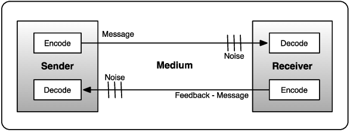

### **Project Communication Management**  

Project Communication Management is the process of ensuring that the right information is delivered to the right stakeholders at the right time using the right methods. It involves planning, executing, monitoring, and controlling project communications to facilitate effective collaboration and decision-making.  

### **Importance of Project Communication Management**  
✅ **Ensures Stakeholder Alignment** – Keeps everyone informed and engaged.  
✅ **Reduces Risks** – Prevents misunderstandings and conflicts.  
✅ **Improves Efficiency** – Streamlines decision-making and collaboration.  
✅ **Enhances Project Success** – Leads to better coordination and timely issue resolution.  

### **Processes of Project Communication Management (Detailed Explanation)**  

Project Communication Management consists of three key processes:  

1. **Plan Communications Management**  
2. **Manage Communications**  
3. **Monitor Communications**  

Each of these processes has specific **Inputs**, **Tools & Techniques**, and **Outputs**, as outlined below:  

---

## **1. Plan Communications Management**  
This process involves determining the communication needs of stakeholders and creating a structured plan to ensure effective information flow.  

### **Inputs:**  
🔹 **Project Charter** – Defines high-level project objectives and key stakeholders.  
🔹 **Project Management Plan** – Includes relevant components such as stakeholder engagement.  
🔹 **Stakeholder Register** – Identifies stakeholder information, interests, and influence.  
🔹 **Enterprise Environmental Factors (EEFs)** – Includes company culture, communication tools, and legal requirements.  
🔹 **Organizational Process Assets (OPAs)** – Includes past project communication lessons, templates, and guidelines.  

### **Tools & Techniques:**  
🛠 **Communication Requirements Analysis** – Identifies stakeholder needs, preferred communication methods, and frequency.  
🛠 **Communication Technology** – Evaluates tools such as emails, instant messaging, meetings, and collaboration platforms.  
🛠 **Communication Models** – Defines sender-receiver models to prevent miscommunication.  
🛠 **Communication Methods** – Determines push (email, reports), pull (intranet, shared files), and interactive (meetings, calls) communication.  
🛠 **Interpersonal & Team Skills** – Active listening, cultural awareness, leadership skills.  
🛠 **Meetings** – Discuss and refine the communication plan with key stakeholders.  

### **Outputs:**  
✅ **Communications Management Plan** – Documents who, what, when, how communication happens.  
✅ **Project Management Plan Updates** – Updates relevant components, such as stakeholder engagement.  
✅ **Project Documents Updates** – Updates the stakeholder register and project schedule.  

---

## **2. Manage Communications**  
This process involves executing the communication plan, ensuring stakeholders receive timely and accurate information.  

### **Inputs:**  
🔹 **Communications Management Plan** – Guides communication execution.  
🔹 **Project Documents** – Includes stakeholder register, issue log, and project reports.  
🔹 **Work Performance Reports** – Provides project status, risks, and performance data.  
🔹 **Enterprise Environmental Factors (EEFs)** – Includes company communication standards and regulations.  
🔹 **Organizational Process Assets (OPAs)** – Includes templates, historical data, and communication lessons learned.  

### **Tools & Techniques:**  
🛠 **Communication Technology** – Uses project management software, video conferencing, emails, etc.  
🛠 **Communication Methods** – Uses formal (reports, memos) and informal (conversations, chats) methods.  
🛠 **Communication Skills** – Includes feedback techniques, clarity, and message structuring.  
🛠 **Project Management Information System (PMIS)** – Uses software tools for document sharing and reporting.  
🛠 **Meetings** – Conducts regular updates, team discussions, and presentations.  
🛠 **Interpersonal & Team Skills** – Active listening, conflict resolution, and negotiation.  

### **Outputs:**  
✅ **Project Communications** – Includes emails, reports, presentations, and stakeholder updates.  
✅ **Project Management Plan Updates** – Modifies communication plans as needed.  
✅ **Project Documents Updates** – Updates project logs, stakeholder information, and risk registers.  
✅ **Organizational Process Assets (OPAs) Updates** – Documents communication lessons for future projects.  

---

## **3. Monitor Communications**  
This process ensures that project communications are effective and meet stakeholder expectations.  

### **Inputs:**  
🔹 **Project Management Plan** – Includes the Communications Management Plan for reference.  
🔹 **Project Documents** – Includes issue logs, risk registers, and performance reports.  
🔹 **Work Performance Data** – Includes raw data on communication efficiency and engagement.  
🔹 **Enterprise Environmental Factors (EEFs)** – Includes regulatory standards and company policies.  
🔹 **Organizational Process Assets (OPAs)** – Includes past reports, templates, and communication strategies.  

### **Tools & Techniques:**  
🛠 **Expert Judgment** – Seeks advice from experienced project managers or communication experts.  
🛠 **Communication Technology** – Uses dashboards, collaboration tools, and tracking systems.  
🛠 **Meetings** – Conducts reviews to assess communication effectiveness.  
🛠 **Stakeholder Engagement Assessment Matrix** – Evaluates whether stakeholders are receiving and understanding information.  
🛠 **Feedback Collection** – Uses surveys, interviews, and direct feedback to assess communication impact.  
🛠 **Interpersonal & Team Skills** – Active listening and problem-solving techniques.  

### **Outputs:**  
✅ **Work Performance Information** – Provides insights into communication efficiency.  
✅ **Change Requests** – Suggests adjustments in communication methods or frequency.  
✅ **Project Management Plan Updates** – Refines communication strategies.  
✅ **Project Documents Updates** – Updates stakeholder engagement strategies.  

---

### **Summary of Project Communication Management Processes**  

| Process | Purpose | Key Tools & Techniques | Key Outputs |
|---------|---------|-----------------------|-------------|
| **Plan Communications Management** | Develops a structured plan for information flow. | Communication models, technology, requirements analysis | Communications Management Plan |
| **Manage Communications** | Ensures timely and effective distribution of project information. | PMIS, meetings, interpersonal skills, reports | Project communications, document updates |
| **Monitor Communications** | Tracks effectiveness and makes necessary adjustments. | Stakeholder feedback, assessment matrices, expert judgment | Work performance info, change requests |

---
## Question: Mention type of communications used in ICT project management?

### **Types of Communications in ICT Project Management**  

In **ICT (Information and Communication Technology) Project Management**, effective communication is crucial for collaboration among stakeholders, teams, and clients. Different types of communication are used to ensure clear information flow throughout the project lifecycle.  

---

## **1. Verbal Communication (Oral)**  
This involves spoken communication, either face-to-face or through digital means.  

📌 **Examples:**  
- Meetings (team meetings, stakeholder briefings, daily stand-ups)  
- Video conferences (Zoom, Microsoft Teams, Google Meet)  
- Phone calls and VoIP communication  
- Presentations and speeches  
- One-on-one discussions  

✅ **Advantages:**  
- Immediate feedback and clarification  
- Encourages collaboration and discussion  
- Helps in quick decision-making  

❌ **Disadvantages:**  
- Can be misinterpreted if not recorded  
- Lacks permanent documentation  

---

## **2. Written Communication**  
In ICT projects, written communication ensures documentation, formal agreements, and clear record-keeping.  

📌 **Examples:**  
- Emails (project updates, approvals, clarifications)  
- Reports (status reports, risk reports, progress reports)  
- Project documentation (requirements, design documents, user manuals)  
- Contracts and agreements  
- Meeting minutes and action plans  

✅ **Advantages:**  
- Provides a formal record  
- Reduces misunderstandings with detailed information  
- Useful for reference and compliance  

❌ **Disadvantages:**  
- Time-consuming to draft and review  
- Can be misinterpreted without clarification  

---

## **3. Visual Communication**  
Visual aids enhance understanding, especially for complex ICT projects.  

📌 **Examples:**  
- Gantt charts (for project timelines)  
- Network diagrams and system architectures  
- Dashboards (real-time project performance tracking)  
- Infographics and flowcharts  
- Wireframes and prototypes (for UI/UX design)  

✅ **Advantages:**  
- Simplifies complex information  
- Engages stakeholders effectively  
- Helps in quick decision-making  

❌ **Disadvantages:**  
- Requires tools and expertise  
- Can be misinterpreted without context  

---

## **4. Non-Verbal Communication**  
Body language, gestures, and facial expressions play a role in ICT project meetings and presentations.  

📌 **Examples:**  
- Facial expressions during meetings  
- Gestures and posture in presentations  
- Silence (can indicate approval or disagreement)  

✅ **Advantages:**  
- Enhances verbal communication  
- Helps in understanding emotions and reactions  

❌ **Disadvantages:**  
- Can lead to misinterpretation  
- Varies across cultures  

---

## **5. Electronic Communication**  
ICT projects heavily rely on digital communication tools for collaboration and efficiency.  

📌 **Examples:**  
- **Instant Messaging** (Slack, Microsoft Teams, WhatsApp)  
- **Collaboration Platforms** (Jira, Trello, Asana)  
- **Cloud-based Document Sharing** (Google Drive, SharePoint)  
- **Automated Notifications & Alerts** (via project management tools)  

✅ **Advantages:**  
- Enables real-time communication and collaboration  
- Reduces the need for physical meetings  
- Improves accessibility across different locations  

❌ **Disadvantages:**  
- Can lead to information overload  
- Security risks if not managed properly  

---

## **6. Formal vs. Informal Communication in ICT Projects**  

| **Communication Type** | **Examples** | **Purpose** |
|------------------|----------------------------|------------------|
| **Formal Communication** | Reports, contracts, official emails, documented meetings | Ensures compliance, accountability, and project tracking |
| **Informal Communication** | Chats, quick calls, team discussions | Enhances teamwork, encourages innovation, and problem-solving |

---

## Question :List out the different dimension of communiation activity.Explain communication methods with example

## **Different Dimensions of Communication Activity**  

Communication in project management, including ICT projects, occurs across several dimensions. These dimensions help define how information flows, who is involved, and the medium used. The key dimensions are:  

1. **Internal vs. External Communication**  
   - **Internal Communication**: Occurs within the project team (e.g., team meetings, emails).  
   - **External Communication**: Involves stakeholders outside the project (e.g., client reports, regulatory communications).  

2. **Formal vs. Informal Communication**  
   - **Formal Communication**: Structured, documented, and follows organizational protocols (e.g., contracts, status reports).  
   - **Informal Communication**: Spontaneous and casual discussions (e.g., chats, brainstorming sessions).  

3. **Vertical vs. Horizontal Communication**  
   - **Vertical Communication**: Information flows **upward** (from team to management) or **downward** (from management to team).  
   - **Horizontal Communication**: Information is shared among peers or departments.  

4. **Written vs. Verbal Communication**  
   - **Written Communication**: Emails, reports, documentation, contracts.  
   - **Verbal Communication**: Meetings, phone calls, video conferences.  

5. **Push vs. Pull vs. Interactive Communication**  
   - **Push Communication**: Information is sent without expecting immediate feedback (e.g., emails, memos).  
   - **Pull Communication**: Stakeholders access information as needed (e.g., intranet, dashboards).  
   - **Interactive Communication**: Two-way real-time communication (e.g., meetings, live chats).  

---

## **Communication Methods with Examples**  

Communication methods refer to how information is shared within a project. There are three main types of communication methods:  

### **1. Interactive Communication** (Two-way, real-time)  
This method allows for immediate feedback and ensures clear understanding.  

📌 **Examples:**  
- Face-to-face meetings  
- Video conferencing (Zoom, Microsoft Teams)  
- Phone calls  
- Live chat (Slack, Microsoft Teams)  

✅ **Best Used For:**  
- Discussions requiring instant feedback  
- Decision-making processes  
- Problem-solving sessions  

❌ **Limitations:**  
- Requires time and availability of participants  
- Can be difficult with remote teams in different time zones  

---

### **2. Push Communication** (One-way, sender to receiver)  
The sender shares information without expecting immediate feedback.  

📌 **Examples:**  
- Emails  
- Newsletters  
- Memos  
- Reports  
- Project updates via Slack or Jira  

✅ **Best Used For:**  
- Sharing general updates  
- Sending announcements  
- Providing instructions  

❌ **Limitations:**  
- Risk of information overload  
- No confirmation if the message was read or understood  

---

### **3. Pull Communication** (Receiver retrieves information when needed)  
Information is made available for stakeholders to access as needed.  

📌 **Examples:**  
- Company intranet  
- Document repositories (Google Drive, SharePoint)  
- Knowledge bases and FAQs  
- Project dashboards (Trello, Asana)  

✅ **Best Used For:**  
- Large audiences needing different levels of information  
- Self-paced learning and reference materials  
- Archiving project-related documents  

❌ **Limitations:**  
- No guarantee stakeholders will access the information  
- Requires regular updates to remain relevant  

---

### **Choosing the Right Communication Method**  

| **Communication Need** | **Recommended Method** |  
|-------------------|-----------------|  
| Urgent issue resolution | **Interactive** (e.g., video call, meeting) |  
| Project updates to stakeholders | **Push** (e.g., email, reports) |  
| Knowledge sharing | **Pull** (e.g., document repositories) |  
| Decision-making | **Interactive** (e.g., real-time meetings) |  

---

## Question:Explain various elements of communication models. Explain contents of communication planning with example

## **Elements of Communication Models**  

A **communication model** explains how information flows between a sender and a receiver. It helps in structuring communication effectively in project management. The key elements of communication models are:  

### **1. Sender (Source)**  
The person or system that initiates the communication.  
🔹 **Example:** A project manager sending a status update email.  

### **2. Message**  
The actual information being communicated.  
🔹 **Example:** "The project is 80% complete, and we need additional resources to meet the deadline."  

### **3. Encoding**  
The process of converting the message into a format suitable for transmission.  
🔹 **Example:** Writing an email, designing a presentation, or speaking in a meeting.  

### **4. Communication Channel (Medium)**  
The method or tool used to deliver the message.  
🔹 **Example:** Email, phone call, video conference, or project dashboard.  

### **5. Receiver**  
The person or group for whom the message is intended.  
🔹 **Example:** A client, project team, or stakeholders.  

### **6. Decoding**  
The process of interpreting the received message.  
🔹 **Example:** A team member reads an email and understands the project status update.  

### **7. Feedback**  
The response from the receiver, indicating whether the message was understood.  
🔹 **Example:** A stakeholder replies with questions or confirmation.  

### **8. Noise**  
Anything that distorts or interferes with the message.  
🔹 **Example:** Poor audio quality in a conference call, unclear email instructions.  

---

## **Contents of Communication Planning**  

Communication planning defines how project information will be shared among stakeholders. The key contents of a **Communication Management Plan** are:  

### **1. Communication Objectives**  
Defines the goals of communication in the project.  
📌 **Example:** Ensure all team members are aware of deadlines and scope changes.  

### **2. Stakeholder Communication Requirements**  
Identifies what information each stakeholder needs.  
📌 **Example:** The sponsor needs financial reports; the development team needs task assignments.  

### **3. Communication Methods and Channels**  
Specifies the tools and methods for communication.  
📌 **Example:**  
- **Weekly status reports** → Email  
- **Urgent project updates** → Slack/Teams chat  
- **Client presentations** → Video calls  

### **4. Frequency of Communication**  
Defines how often communication will take place.  
📌 **Example:**  
- **Daily stand-up meetings** → Every morning  
- **Monthly stakeholder updates** → First Monday of each month  

### **5. Roles and Responsibilities**  
Assigns responsibilities for sending and receiving communication.  
📌 **Example:**  
- Project Manager → Sends progress reports  
- Team Leads → Report task completion status  

### **6. Escalation Process**  
Outlines how to handle unresolved issues.  
📌 **Example:** If a major risk is identified, escalate to senior management within 24 hours.  

### **7. Communication Constraints**  
Lists any limitations such as legal requirements, security, or company policies.  
📌 **Example:** Client data must be shared via a secure portal, not via email.  

### **8. Feedback Mechanism**  
Defines how to collect responses and measure communication effectiveness.  
📌 **Example:** Use surveys after meetings to assess understanding.  

---

## **Example of a Communication Plan for a Software Development Project**  

| **Aspect** | **Details** |  
|------------|------------|  
| **Objective** | Ensure timely updates on project progress and risk management. |  
| **Stakeholders** | Project team, sponsor, client, QA team. |  
| **Methods** | Emails, Slack, Jira, Zoom meetings. |  
| **Frequency** | Daily stand-ups, weekly reports, monthly client meetings. |  
| **Responsibilities** | PM sends reports, developers update Jira, QA shares test results. |  
| **Escalation** | High-risk issues reported to senior management within 24 hours. |  
| **Feedback** | Post-meeting surveys, stakeholder feedback sessions. |  

---

## Question:what are the basics of communication project management?(less imp)

## **Basics of Communication in Project Management**  

Effective communication is essential for successful project management. It ensures that all stakeholders are informed, aligned, and engaged throughout the project lifecycle. The basics of communication in project management include the following key principles:  

---

### **1. Understanding Stakeholders' Communication Needs**  
Every project has different stakeholders, each with unique communication preferences and expectations.  
📌 **Key Aspects:**  
- Identify who needs information (sponsors, team members, clients).  
- Determine their preferred communication channels (emails, meetings, reports).  
- Define the level of detail required for each stakeholder group.  

✅ **Example:** The CEO may require high-level progress reports, while developers need detailed task updates.  

---

### **2. Choosing the Right Communication Method**  
Selecting the appropriate method for communication enhances efficiency and clarity.  
📌 **Communication Methods:**  
- **Interactive Communication** (two-way): Meetings, video calls, discussions.  
- **Push Communication** (one-way): Emails, reports, memos.  
- **Pull Communication** (on-demand): Document repositories, dashboards, intranets.  

✅ **Example:** A daily stand-up meeting (interactive) is best for quick team updates, while a project wiki (pull) is useful for accessing project documents.  

---

### **3. Creating a Communication Plan**  
A structured communication plan ensures that information is shared correctly and consistently.  
📌 **Key Elements of a Communication Plan:**  
- **What**: Type of information to be shared.  
- **Who**: Target audience.  
- **How**: Mode of communication.  
- **When**: Frequency of updates.  
- **Who is responsible**: Team member assigned to send communication.  

✅ **Example:** A project manager may send weekly status reports to stakeholders every Friday via email.  

---

### **4. Ensuring Clear and Concise Communication**  
Communication should be simple, clear, and easy to understand.  
📌 **Best Practices:**  
- Avoid technical jargon when speaking to non-technical stakeholders.  
- Use visuals (charts, graphs) for complex data.  
- Keep emails and reports structured and to the point.  

✅ **Example:** Instead of a long email, use bullet points and a summary for quick reading.  

---

### **5. Using Project Management Communication Tools**  
Technology improves communication efficiency and collaboration.  
📌 **Common Tools:**  
- **Emails & Messaging:** Outlook, Slack, Microsoft Teams.  
- **Project Management Software:** Jira, Trello, Asana.  
- **Collaboration Platforms:** Google Drive, SharePoint.  
- **Meetings & Video Calls:** Zoom, WebEx, Microsoft Teams.  

✅ **Example:** Trello can be used to track project progress, while Zoom is ideal for virtual team meetings.  

---

### **6. Managing Communication Barriers**  
Communication can be disrupted by various barriers, such as misunderstandings, lack of engagement, or technical issues.  
📌 **How to Overcome Barriers:**  
- Encourage feedback and open discussions.  
- Adapt communication style to the audience.  
- Use multiple communication methods if necessary.  

✅ **Example:** If a team member misinterprets a task in an email, a quick follow-up call can provide clarity.  

---

### **7. Monitoring and Improving Communication**  
Regularly assessing communication effectiveness ensures continuous improvement.  
📌 **Ways to Monitor Communication:**  
- Conduct feedback surveys.  
- Review stakeholder engagement levels.  
- Hold retrospective meetings to improve communication strategies.  

✅ **Example:** If stakeholders complain about too many emails, the team can switch to a weekly digest instead of daily updates.  

---

