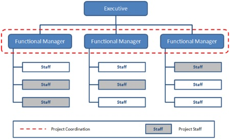
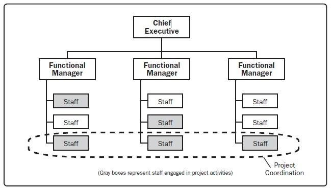
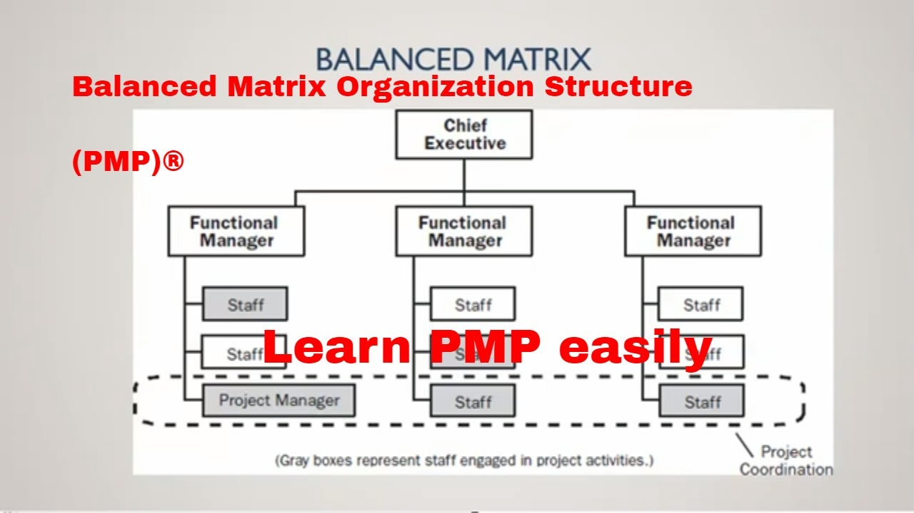
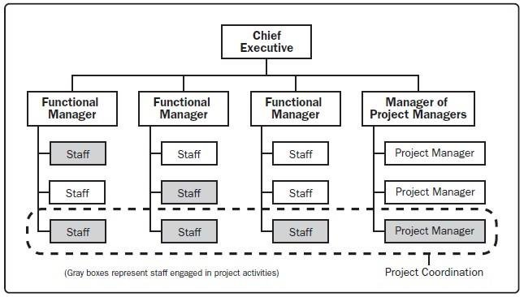

# Chapter-2: Project Organization and Project Life Cycle

### 2.1**📌 Organizational Structure in Project Management**  

An **organizational structure** defines how activities, responsibilities, and authority are allocated within a company. It influences how projects are executed, how teams collaborate, and the level of decision-making power project managers have.  

---
### 🏢 Types of Organizational Structures in Project Management

### 2.1.1.**📌 Functional Organizational Structure**  

A **functional structure** is a traditional business model where employees are grouped based on their specific job roles or functions (e.g., Marketing, Finance, IT). Each department is managed by a functional leader, and project work is typically handled within these departments.  

---

## **📌 Key Characteristics of Functional Structure**  
✔ **Hierarchical Organization** – Authority flows from top management to department heads and employees.  
✔ **Specialized Departments** – Employees work in dedicated teams based on their expertise (e.g., HR, Finance, Operations).  
✔ **Clear Chain of Command** – Each employee reports to a functional manager.  
✔ **Limited Project Manager Authority** – Project managers have minimal control; functional managers make key decisions.  
✔ **Efficient Resource Utilization** – Employees work within their expertise, improving efficiency.  

---

📌 **CEO**
     ├── 📂 **Finance Department**  
     │       ├── 📈 Finance Manager  
     │       ├── 📊 Accountants  
     │       ├── 💰 Financial Analysts  
     │  
     ├── 🎯 **Marketing Department**  
     │       ├── 📢 Marketing Manager  
     │       ├── 📌 SEO Specialists  
     │       ├── 🎨 Graphic Designers  
     │  
     ├── 🖥 **IT Department**  
     │       ├── 💻 IT Manager  
     │       ├── 🖥 Software Developers  
     │       ├── 🔒 Cybersecurity Experts  
     │  
     ├── 🏗 **Operations Department**  
     │       ├── 🏭 Operations Manager  
     │       ├── 📦 Supply Chain Specialists  
     │       ├── 🚛 Logistics Coordinators  




## **📌 Advantages of Functional Structure**  
✅ **Specialization & Expertise** – Employees develop deep expertise in their functional area.  
✅ **Clear Reporting Structure** – Reduces confusion with well-defined roles.  
✅ **Operational Efficiency** – Departments operate efficiently under a structured hierarchy.  
✅ **Career Growth & Training** – Employees receive focused training in their expertise.  

---

## **📌 Disadvantages of Functional Structure**  
❌ **Limited Flexibility** – Employees may focus too much on their department's goals instead of overall company success.  
❌ **Weak Cross-Department Collaboration** – Projects requiring multiple departments may face communication gaps.  
❌ **Slow Decision-Making** – Approvals must go through multiple levels of management.  
❌ **Minimal Project Manager Authority** – Functional managers control resources, making project execution harder.  

---

### **📌 When to Use a Functional Structure?**  
✅ Organizations that need **high efficiency** and **specialization**.  
✅ Stable industries like **finance, healthcare, and manufacturing**.  
✅ Businesses that **do not rely heavily on cross-functional projects**.  

---

## 2.1.2**📌 Projectized Organizational Structure**  

A **projectized structure** is a type of organizational framework where most of the company's resources, including employees and budgets, are dedicated to projects rather than functional departments. In this structure, the **Project Manager (PM)** has full authority over project decisions, resources, and teams, making it highly effective for organizations that work primarily on projects.  

---

## **📌 Key Characteristics of a Projectized Organization**  
✔ **Project-Centric Approach** – All work is organized around projects instead of departments.  
✔ **High Authority of Project Managers** – The PM controls resources, schedules, and budgets.  
✔ **Dedicated Teams** – Employees are assigned exclusively to projects and report directly to the PM.  
✔ **Fast Decision-Making** – Less bureaucracy allows quicker responses to project needs.  
✔ **High Adaptability** – Teams are flexible and can be restructured based on project requirements.  

---

```
📌 **CEO**
     ├── 🏗 **Project A**
     │       ├── 👨‍💼 Project Manager A  
     │       ├── 👨‍💻 Developers  
     │       ├── 🎨 Designers  
     │       ├── 📊 Analysts  
     │  
     ├── 🔬 **Project B**
     │       ├── 👩‍💼 Project Manager B  
     │       ├── 👨‍💻 Engineers  
     │       ├── 💰 Finance Experts  
     │       ├── 🔍 Quality Assurance  
     │  
     ├── 🌍 **Project C**
     │       ├── 👨‍💼 Project Manager C  
     │       ├── 📦 Supply Chain Team  
     │       ├── 🔧 Technicians  
     │       ├── 🚀 Logistics Coordinators  
```

---


## **📌 Advantages of a Projectized Structure**  
✅ **Strong Project Focus** – Resources and teams are fully dedicated to project success.  
✅ **Faster Decision-Making** – Fewer hierarchical layers mean decisions are made quickly.  
✅ **Better Communication** – Direct reporting to project managers improves collaboration.  
✅ **High Team Motivation** – Employees work closely within teams, increasing accountability.  

---

## **📌 Disadvantages of a Projectized Structure**  
❌ **Resource Duplication** – Teams are assigned to projects separately, leading to potential inefficiencies.  
❌ **Job Uncertainty** – Employees may have uncertain roles after project completion.  
❌ **High Costs** – Maintaining multiple teams for each project can be expensive.  
❌ **Limited Functional Expertise** – Since teams are project-based, deep functional expertise may be lost.  

---

## **📌 When to Use a Projectized Structure?**  
✅ **Industries that rely heavily on projects**, such as **construction, engineering, consulting, and event management**.  
✅ **Organizations where project speed and flexibility are critical**.  
✅ **Companies that need a strong project management culture** with **clear accountability**.  

---

## 2.1.3 **📌 Matrix Organizational Structure**  

A **Matrix Organization** is a hybrid structure that blends elements of both **Functional** and **Projectized** structures. Employees report to **two managers**—a **functional manager** (who oversees expertise and career growth) and a **project manager** (who directs project-specific tasks). This structure enhances flexibility and resource efficiency but requires strong communication and conflict resolution mechanisms.  

---

## **📌 Key Characteristics of a Matrix Organization**  
✔ **Dual Reporting System** – Employees report to both **functional** and **project managers**.  
✔ **Shared Resources** – Teams work across multiple projects while maintaining functional expertise.  
✔ **Collaboration Across Departments** – Encourages knowledge sharing between functional units.  
✔ **Balanced Authority** – Functional and project managers share decision-making.  
✔ **Efficient Resource Utilization** – Resources are dynamically allocated across projects.  

---

```
📌 **CEO**
     ├── 📂 **Functional Departments**
     │       ├── 👨‍💼 HR Manager
     │       ├── 👩‍💻 IT Manager
     │       ├── 📈 Finance Manager
     │       ├── 🏗 Operations Manager
     │  
     ├── 🏗 **Projects**
     │       ├── 📊 Project A  
     │       │       ├── 👨‍💼 Project Manager  
     │       │       ├── 👩‍💻 IT Team (from IT Department)  
     │       │       ├── 📈 Finance Team (from Finance Department)  
     │  
     │       ├── 🔬 Project B  
     │       │       ├── 👨‍💼 Project Manager  
     │       │       ├── 🏗 Operations Team (from Operations Department)  
     │       │       ├── 📊 HR Team (from HR Department)  
```

---

## **📌 Types of Matrix Organizations**  

| **Type**               | **Description** | **Project Manager Authority** | **Functional Manager Authority** | **Resource Availability** |
|-----------------------|---------------|-------------------------------|---------------------------------|--------------------------|
| **Weak Matrix** | More control remains with the **functional managers**; project managers act as coordinators. | 🟢 Low | 🔴 High | 🔴 Low |
| **Balanced Matrix** | Power is **shared equally** between functional and project managers. | 🟡 Medium | 🟡 Medium | 🟡 Medium |
| **Strong Matrix** | The **project manager has more authority** than functional managers. | 🔴 High | 🟢 Low | 🟢 High |

---

fig:weak matrix organization



fig:balanced matrix organizatin


fig:strong matrix organization


## **📌 Advantages of a Matrix Structure**  
✅ **Efficient Resource Utilization** – Employees work across multiple projects, reducing redundancy.  
✅ **Enhanced Communication** – Encourages cross-functional collaboration.  
✅ **Flexibility** – Easily adapts to changing project needs.  
✅ **Improved Skill Development** – Employees gain expertise from both functional and project managers.  

---

## **📌 Disadvantages of a Matrix Structure**  
❌ **Confusion in Reporting** – Employees may struggle with dual reporting lines.  
❌ **Power Struggles** – Conflicts can arise between functional and project managers.  
❌ **Higher Complexity** – Managing multiple authority layers requires strong leadership.  
❌ **Slower Decision-Making** – Requires coordination between multiple managers.  

---

## **📌 When to Use a Matrix Structure?**  
✅ **Organizations with multiple ongoing projects** requiring cross-functional expertise.  
✅ **Industries such as IT, aerospace, automotive, and pharmaceuticals** where projects demand diverse skills.  
✅ **Companies needing both operational stability and project-based flexibility.**  

---

# 2.2**📌 Project Life Cycle and Its Phases**  

The **Project Life Cycle** is the structured process that a project follows from its **initiation to closure**. It consists of distinct **phases**, each with specific objectives, deliverables, and activities. Understanding these phases helps teams manage projects efficiently and achieve their goals.  

---

## **📌 Phases of the Project Life Cycle**  

| **Phase** | **Description** | **Key Activities** | **Key Deliverables** |
|-----------|---------------|--------------------|----------------------|
| **1️⃣ Initiation** 🏁 | Defines the project's purpose, feasibility, and stakeholders. | - Define project objectives <br> - Identify stakeholders <br> - Conduct feasibility study <br> - Develop business case | 📜 **Project Charter** <br> 🎯 **Feasibility Study** |
| **2️⃣ Planning** 📝 | Develops a detailed roadmap for execution. | - Define scope, schedule, and budget <br> - Identify risks and mitigation strategies <br> - Allocate resources <br> - Develop a communication plan | 📊 **Project Management Plan** <br> ⏳ **Work Breakdown Structure (WBS)** |
| **3️⃣ Execution** 🚀 | Implements the project plan and manages team activities. | - Assign tasks and execute work <br> - Monitor performance <br> - Manage stakeholder expectations <br> - Ensure quality standards | ⚙ **Project Deliverables** <br> 🔄 **Status Reports** |
| **4️⃣ Monitoring & Controlling** 🔍 | Tracks project progress and makes necessary adjustments. | - Measure project performance <br> - Control scope, schedule, and cost <br> - Conduct risk assessments <br> - Ensure quality compliance | 📈 **Performance Reports** <br> ✅ **Change Requests** |
| **5️⃣ Closure** 🎉 | Officially completes the project and hands it over. | - Conduct final evaluation <br> - Obtain stakeholder approval <br> - Document lessons learned <br> - Release project resources | 🏆 **Final Report** <br> 📜 **Lessons Learned Document** |

---

## **📌 Key Characteristics of the Project Life Cycle**  

✔ **Sequential Process** – Each phase follows a logical order.  
✔ **Flexible & Iterative** – Adjustments can be made based on performance.  
✔ **Time-Bound** – Defined start and end points.  
✔ **Goal-Oriented** – Focuses on achieving project success criteria.  
✔ **Stakeholder Engagement** – Requires continuous collaboration and communication.  

---

## Question1: **Differentiate between project and product life cycle**


| Feature            | **Project Life Cycle**                           | **Product Life Cycle**                      |
|--------------------|--------------------------------|--------------------------------|
| **Definition**    | Covers the phases of a project from initiation to closure. | Covers the stages a product goes through from introduction to discontinuation. |
| **Duration**      | Temporary (has a defined start and end). | Long-term (lasts until the product is retired). |
| **Focus**         | Execution of a specific project. | Market performance and lifecycle of a product. |
| **Objective**     | Deliver a unique output (product, service, or result). | Maximize product success in the market. |
| **Phases**        | 1. Initiation  2. Planning  3. Execution  4. Monitoring & Controlling  5. Closure | 1. Introduction  2. Growth  3. Maturity  4. Decline |
| **Example**       | Developing a new mobile app. | The lifecycle of a smartphone model in the market. |
| **Flexibility**   | Scope and goals are defined at the beginning and rarely change. | Market conditions can affect changes in the product lifecycle. |
| **End Result**    | A completed project with deliverables. | A product that evolves over time before being discontinued. |


## Question 2:**explain the four frames of organizations .How can they help project managers understand the organizational context for their projects?**

The **Four Frames of Organizations** is a model developed by **Bolman and Deal** that helps project managers understand different perspectives of an organization. These four frames are:  

1. **Structural Frame**  
2. **Human Resource Frame**  
3. **Political Frame**  
4. **Symbolic Frame**  

### **1. Structural Frame** (The Blueprint of the Organization)  
- **Focus**: Organization’s rules, roles, responsibilities, processes, and hierarchy.  
- **Key Elements**: Division of labor, organizational charts, policies, and formal procedures.  
- **How It Helps Project Managers**:  
  - Clarifies authority and decision-making structures.  
  - Helps define roles and responsibilities within the project team.  
  - Ensures proper resource allocation and workflow efficiency.  
- **Example**: A project manager in a rigid, hierarchical company may need to follow strict approval processes before making changes.  

### **2. Human Resource Frame** (People and Their Needs)  
- **Focus**: People, motivation, team dynamics, and company culture.  
- **Key Elements**: Employee well-being, leadership style, training, communication, and team collaboration.  
- **How It Helps Project Managers**:  
  - Improves team motivation and engagement.  
  - Helps in conflict resolution and team building.  
  - Encourages collaboration and effective communication.  
- **Example**: A project manager working with a cross-functional team must focus on team-building activities and open communication to enhance productivity.  

### **3. Political Frame** (Power, Conflict, and Influence)  
- **Focus**: Power dynamics, competition for resources, alliances, and organizational politics.  
- **Key Elements**: Stakeholder interests, power struggles, resource allocation, and influence tactics.  
- **How It Helps Project Managers**:  
  - Helps identify key stakeholders and their interests.  
  - Equips managers to navigate office politics and conflicts.  
  - Aids in securing support and resources for the project.  
- **Example**: A project manager might need to gain executive support or align with influential stakeholders to ensure project success.  

### **4. Symbolic Frame** (Culture, Meaning, and Vision)  
- **Focus**: Organizational culture, values, rituals, symbols, and storytelling.  
- **Key Elements**: Mission statements, leadership vision, company traditions, and ceremonies.  
- **How It Helps Project Managers**:  
  - Aligns the project with organizational values and vision.  
  - Boosts team morale and commitment through meaningful engagement.  
  - Enhances project credibility by linking it to company traditions and identity.  
- **Example**: A project aligned with a company's sustainability mission will gain stronger support if it resonates with employees' values.  

---

### **How These Frames Help Project Managers**  
Understanding these four frames enables project managers to:  
✅ Identify and address organizational challenges.  
✅ Build stronger relationships with stakeholders.  
✅ Adapt their management style based on the organization’s culture and structure.  
✅ Navigate office politics and power dynamics effectively.  
✅ Align projects with organizational goals for greater success.  

Would you like further details on how to apply these frames in real-world project scenarios? 😊

## Question 3: **Compare process-based organization  and project-based organization with example**

### **Comparison of Process-Based Organization vs. Project-Based Organization**  

| Feature | **Process-Based Organization** | **Project-Based Organization** |
|---------|----------------------------|----------------------------|
| **Definition** | An organization structured around functional departments where work is continuous and repetitive. | An organization where work is structured around temporary projects with unique deliverables. |
| **Focus** | Efficiency in routine operations and standardized processes. | Delivering specific projects within scope, time, and budget. |
| **Structure** | Functional departments (e.g., HR, IT, Finance) with a **hierarchical structure**. | Teams are formed based on projects, often working independently of functional departments. |
| **Authority & Decision-Making** | Functional managers have the highest authority. | Project managers have the highest authority. |
| **Work Nature** | Ongoing and repetitive tasks (e.g., manufacturing, customer service). | Temporary and unique tasks (e.g., software development, construction projects). |
| **Flexibility** | Less flexible due to rigid departmental roles. | Highly flexible, as teams can be restructured based on project needs. |
| **Resource Allocation** | Employees are assigned to departments permanently. | Employees are assigned to projects and may change roles frequently. |
| **Example Industries** | Manufacturing, banking, healthcare, government institutions. | IT services, construction, event management, consulting firms. |
| **Example** | A **car manufacturing company** where production follows a fixed process and workflow. | A **software company** developing a mobile app for a client with a dedicated project team. |

### **Conclusion**  
- **Process-Based Organizations** are efficient for routine, ongoing operations but lack flexibility for unique projects.  
- **Project-Based Organizations** offer more agility, making them suitable for dynamic industries where innovation and customization are required. 🚀

## Question 7:**What are the advantages of structured organizational model? "unstructured organization model gives greater flexibility and less bureaucracy " Do you agree with this statement? Give you view**

### **Advantages of a Structured Organizational Model**  

A **structured organizational model** is a well-defined framework where roles, responsibilities, and reporting hierarchies are clearly established. It provides:  

1. **Clear Role Definition** – Employees have well-defined responsibilities, reducing confusion.  
2. **Efficient Workflow** – Standardized processes improve operational efficiency.  
3. **Better Coordination & Communication** – Formal structures help in smoother decision-making and team collaboration.  
4. **Accountability & Performance Management** – Employees are held accountable, leading to higher productivity.  
5. **Scalability & Stability** – Structured organizations can grow systematically and maintain stability over time.  
6. **Risk Management** – Established policies and procedures help in mitigating risks effectively.  
7. **Compliance & Legal Adherence** – Clearly documented policies ensure organizations comply with industry regulations.  

---

### **Unstructured Organization Model: Flexibility vs. Bureaucracy**  

The statement **"Unstructured organization model gives greater flexibility and less bureaucracy"** is partially **true**, but it comes with both advantages and challenges.  

#### **Why It’s True (Advantages of Unstructured Model):**  
✔ **High Flexibility** – Employees can take on multiple roles, adapt to change quickly.  
✔ **Faster Decision-Making** – Fewer hierarchical barriers lead to quicker responses.  
✔ **Encourages Innovation** – Employees can freely share ideas without rigid procedures.  
✔ **Less Bureaucracy** – No excessive paperwork or formal approval processes.  

#### **Challenges of an Unstructured Organization:**  
✘ **Lack of Clear Roles** – Employees may struggle with undefined responsibilities.  
✘ **Inefficient Decision-Making** – Without a clear structure, conflicts may arise in leadership and decision authority.  
✘ **Scalability Issues** – As the organization grows, lack of structure may cause inefficiencies.  
✘ **Accountability Problems** – Difficult to measure individual performance and responsibility.  

---

### **My View**  
Both structured and unstructured models have their merits. A **hybrid approach**—where organizations maintain a structured framework but allow flexibility in decision-making—can provide the best of both worlds. **For large organizations**, a structured model is essential for stability, while **for startups and creative industries**, an unstructured model fosters innovation and adaptability. 🚀

## Question:**Describe options that organizatins have for selecting projects that align with their mission or strategy ,and describe how each might work differently in the selection of IT projects**

### **Project Selection Methods for Aligning with Organizational Mission & Strategy**  

Organizations use various **project selection methods** to ensure that their investments align with their strategic goals. The method chosen can significantly impact how **IT projects** are selected compared to other types of projects.  

---

### **1. Financial Methods**  
**a) Benefit-Cost Ratio (BCR)**  
- **How It Works**: Compares the benefits of a project against its costs. A ratio greater than 1 indicates a good investment.  
- **Impact on IT Projects**: Helps justify IT investments by evaluating if the project generates more savings/revenue than its cost.  
- **Example**: A company may choose to develop a new e-commerce platform if projected revenue outweighs development costs.  

**b) Net Present Value (NPV)**  
- **How It Works**: Calculates the present value of future cash flows generated by a project. A positive NPV indicates profitability.  
- **Impact on IT Projects**: Helps in evaluating large IT investments (e.g., cloud migration, ERP system upgrades) by considering long-term financial impact.  
- **Example**: If an IT automation project has a high NPV due to cost savings, it would be prioritized.  

**c) Internal Rate of Return (IRR)**  
- **How It Works**: Determines the profitability of a project by calculating the discount rate at which NPV becomes zero.  
- **Impact on IT Projects**: IT projects with a high IRR (e.g., software automation reducing operational costs) may be prioritized.  
- **Example**: A company may invest in cybersecurity infrastructure if it shows a high IRR by preventing costly data breaches.  

---

### **2. Strategic Alignment Methods**  
**a) Balanced Scorecard Approach**  
- **How It Works**: Evaluates projects based on four perspectives—financial, customer, internal processes, and learning & growth.  
- **Impact on IT Projects**: Ensures IT projects support business goals beyond financial return, like improving customer experience or innovation.  
- **Example**: A bank selects an AI-driven chatbot project if it enhances customer service, even if the financial return is uncertain initially.  

**b) Portfolio Alignment**  
- **How It Works**: Ensures projects fit within the organization’s overall project portfolio and resource availability.  
- **Impact on IT Projects**: Helps prioritize IT projects that fit within the company's technology roadmap and available IT resources.  
- **Example**: A company may delay an AI project if it already has too many ongoing IT initiatives.  

---

### **3. Scoring and Ranking Methods**  
**a) Weighted Scoring Model**  
- **How It Works**: Assigns scores to projects based on multiple criteria (e.g., cost, risk, strategic value, ROI).  
- **Impact on IT Projects**: Helps rank IT projects based on business impact, security, and scalability.  
- **Example**: A company developing a new mobile app may score higher than a server upgrade if customer engagement is a priority.  

**b) Payback Period**  
- **How It Works**: Calculates the time required to recover the initial investment.  
- **Impact on IT Projects**: Prioritizes quick-win IT projects that deliver fast cost savings or revenue gains.  
- **Example**: A company might choose an IT automation project with a 1-year payback over a 5-year ERP upgrade.  

---

### **4. Risk-Based Methods**  
**a) Risk vs. Reward Analysis**  
- **How It Works**: Evaluates projects based on potential risks and expected benefits.  
- **Impact on IT Projects**: Helps IT teams assess cybersecurity risks, technical feasibility, and regulatory compliance.  
- **Example**: A bank may reject a cloud migration project due to high security and compliance risks.  

**b) Delphi Technique**  
- **How It Works**: Uses expert opinions to evaluate and prioritize projects.  
- **Impact on IT Projects**: Useful for selecting innovative IT projects where data is limited.  
- **Example**: AI and blockchain projects may require expert evaluation before selection.  

---

### **How IT Project Selection Differs from Other Projects**  
1. **Technology Complexity** – IT projects often require technical feasibility studies, unlike traditional infrastructure projects.  
2. **Security & Compliance** – IT projects need to consider cybersecurity risks and data privacy laws.  
3. **Rapid Innovation** – IT projects may have a shorter lifecycle, requiring faster decision-making compared to long-term infrastructure projects.  
4. **Non-Financial Value** – IT projects may be selected based on innovation, customer experience, or digital transformation rather than direct financial returns.  
