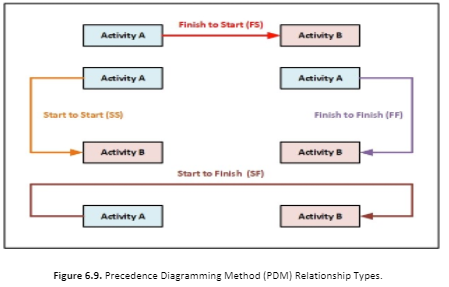
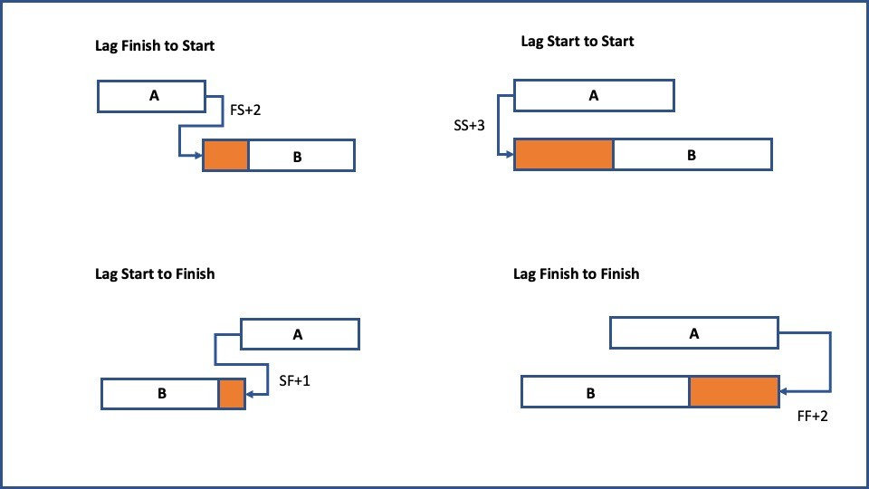

# Chapter 8    Project Time Management

### **Project Time Management: A Detailed Guide**

#### **What is Project Time Management?**
Project Time Management refers to the processes and techniques used to ensure that a project is completed on schedule. It involves planning, scheduling, monitoring, and controlling activities to maximize efficiency and meet deadlines. Effective time management helps in avoiding delays, cost overruns, and resource wastage.

---

## **Key Processes of Project Time Management**
Project Time Management is generally divided into the following processes as per the **PMBOK (Project Management Body of Knowledge)** guide:

### **1. Plan Schedule Management**
- This step defines how the project's schedule will be planned, executed, and controlled.
- **Key Activities:**
  - Selecting scheduling methodologies (e.g., Critical Path Method, Agile scheduling).
  - Setting policies and procedures for time management.
  - Identifying tools to be used (e.g., Gantt Charts, Project Management Software).

### **2. Define Activities**
- Breaking down the project into tasks or activities.
- **Key Activities:**
  - Using a **Work Breakdown Structure (WBS)** to identify tasks.
  - Listing activities required to complete project deliverables.
  - Identifying dependencies between tasks.

### **3. Sequence Activities**
- Determining the order in which tasks should be performed.
- **Key Techniques:**
  - **Precedence Diagramming Method (PDM)**: Showing task dependencies.
  - **Leads and Lags**: Adjusting the timing of dependent tasks.
  - **Dependency Types**:
    - **Finish-to-Start (FS)**: Task B starts only after Task A finishes.
    - **Start-to-Start (SS)**: Task B starts only when Task A starts.
    - **Finish-to-Finish (FF)**: Task B finishes only when Task A finishes.
    - **Start-to-Finish (SF)**: Task B finishes only when Task A starts.

### **4. Estimate Activity Durations**
- Predicting how long each activity will take.
- **Common Estimation Techniques:**
  - **Expert Judgment**: Based on past experience.
  - **Analogous Estimating**: Using data from similar projects.
  - **Parametric Estimating**: Using mathematical formulas.
  - **Three-Point Estimating**: (Optimistic + Pessimistic + Most Likely) / 3.
  - **Bottom-Up Estimating**: Breaking down each task for a detailed estimate.

### **5. Develop Schedule**
- Creating the project schedule by assigning start and end dates to tasks.
- **Key Tools and Techniques:**
  - **Gantt Charts**: Visual timeline for tracking activities.
  - **Critical Path Method (CPM)**: Identifies the longest sequence of dependent tasks.
  - **Program Evaluation and Review Technique (PERT)**: Uses probabilistic time estimates.
  - **Resource Leveling**: Adjusting schedules based on resource constraints.

### **6. Control Schedule**
- Monitoring project progress and making necessary adjustments.
- **Key Actions:**
  - Comparing actual vs. planned progress.
  - Identifying delays and risks.
  - Using schedule compression techniques:
    - **Crashing**: Adding extra resources to speed up tasks.
    - **Fast Tracking**: Overlapping tasks to reduce schedule time.
  - Updating stakeholders on schedule status.

---

## **Benefits of Effective Project Time Management**
1. **On-Time Project Completion** – Avoids delays and penalties.
2. **Cost Control** – Prevents budget overruns.
3. **Efficient Resource Utilization** – Optimizes workforce and materials.
4. **Improved Productivity** – Enhances work efficiency and motivation.
5. **Better Risk Management** – Anticipates and mitigates scheduling risks.

---

## **Challenges in Project Time Management**
- **Unrealistic Deadlines** – Over-optimistic estimates.
- **Scope Creep** – Frequent changes in project requirements.
- **Resource Constraints** – Limited availability of skilled workforce.
- **Poor Communication** – Lack of clarity on timelines.
- **Unforeseen Risks** – Market changes, technical failures, etc.

---

## **Conclusion**
Project Time Management is crucial for the success of any project. By following structured planning, scheduling, and monitoring techniques, project managers can ensure timely delivery while maintaining quality and cost efficiency. Using the right tools, methodologies, and team coordination can significantly improve project outcomes.

## **Processes of Project Time Management in Detail**

Project Time Management consists of six key processes that ensure a project is completed on time. These processes are outlined in the **Project Management Body of Knowledge (PMBOK)** guide and help project managers plan, schedule, monitor, and control project timelines.

---

## **1. Plan Schedule Management**
### **Purpose:**
- Establishes policies, procedures, and documentation for managing the project schedule.
- Defines how schedules will be planned, developed, executed, and controlled.

### **Key Inputs:**
- Project Charter
- Project Management Plan
- Organizational Process Assets (e.g., historical data, templates)
- Enterprise Environmental Factors (e.g., market conditions, company culture)

### **Tools & Techniques:**
- **Expert Judgment**: Consulting experienced professionals for scheduling strategies.
- **Analytical Techniques**: Evaluating project constraints and trade-offs.
- **Meetings**: Stakeholder discussions to define scheduling methods.

### **Key Outputs:**
- **Schedule Management Plan**: A document that outlines how the project schedule will be developed, monitored, and controlled.

---

## **2. Define Activities**
### **Purpose:**
- Identifies and documents all the tasks required to complete project deliverables.

### **Key Inputs:**
- Schedule Management Plan
- Scope Baseline (Includes Project Scope Statement, Work Breakdown Structure (WBS), and WBS Dictionary)
- Organizational Process Assets

### **Tools & Techniques:**
- **Decomposition**: Breaking down work packages into smaller tasks.
- **Rolling Wave Planning**: Planning work in detail for the near term while keeping future work at a high level.
- **Expert Judgment**: Consulting professionals to define necessary activities.

### **Key Outputs:**
- **Activity List**: A comprehensive list of all project activities.
- **Activity Attributes**: Additional details such as dependencies, responsible teams, and required resources.
- **Milestone List**: A list of significant events or checkpoints in the project.

---

## **3. Sequence Activities**
### **Purpose:**
- Establishes the logical order in which activities should be executed.

### **Key Inputs:**
- Activity List
- Activity Attributes
- Milestone List
- Schedule Management Plan
- Project Scope Statement

### **Tools & Techniques:**
- **Precedence Diagramming Method (PDM)**: A visual representation of task dependencies.
- **Leads and Lags**:
  - *Lead*: Allows an activity to start before its predecessor finishes.
  - *Lag*: Introduces a delay between dependent tasks.
- **Dependency Determination**:
  - **Mandatory Dependencies**: Legally or contractually required (e.g., concrete must dry before painting).
  - **Discretionary Dependencies**: Best practices but not required (e.g., following a preferred workflow).
  - **External Dependencies**: Outside influences like government approvals.
  - **Internal Dependencies**: Within the project team's control.

### **Key Outputs:**
- **Project Schedule Network Diagram**: A graphical representation of activity sequences.

---

## **4. Estimate Activity Durations**
### **Purpose:**
- Determines the time required to complete each activity.

### **Key Inputs:**
- Activity List and Attributes
- Resource Calendars
- Project Scope Statement
- Risk Register

### **Tools & Techniques:**
- **Expert Judgment**: Based on experience from past projects.
- **Analogous Estimating**: Using historical data from similar projects.
- **Parametric Estimating**: Using mathematical formulas (e.g., cost per square foot for construction).
- **Three-Point Estimating** (PERT Analysis):
  - Optimistic Estimate (O)
  - Pessimistic Estimate (P)
  - Most Likely Estimate (M)
  - **Formula**: `(O + 4M + P) / 6`
- **Bottom-Up Estimating**: Summing up estimates for smaller tasks.

### **Key Outputs:**
- **Activity Duration Estimates**: Estimated time required for each activity.
- **Basis of Estimates**: Explanation of assumptions used in estimating durations.

---

## **5. Develop Schedule**
### **Purpose:**
- Creates a complete project schedule with planned start and end dates.

### **Key Inputs:**
- Activity List and Attributes
- Activity Duration Estimates
- Project Schedule Network Diagram
- Resource Calendars
- Risk Register

### **Tools & Techniques:**
- **Critical Path Method (CPM)**:
  - Identifies the longest path of dependent tasks.
  - Determines the shortest possible project duration.
- **Critical Chain Method (CCM)**:
  - Adds buffers to account for uncertainties.
- **Resource Leveling**:
  - Adjusts task schedules based on resource availability.
- **Schedule Compression**:
  - **Crashing**: Adding extra resources to speed up tasks.
  - **Fast Tracking**: Performing tasks in parallel instead of sequentially.
- **Project Management Software**:
  - Tools like Microsoft Project, Primavera P6, or Jira.

### **Key Outputs:**
- **Project Schedule**: Includes start and end dates for all activities.
- **Schedule Baseline**: Approved version of the schedule used for comparison.
- **Schedule Data**: Details such as milestones, dependencies, and constraints.
- **Project Calendars**: Specifies working days, holidays, and shifts.

---

## **6. Control Schedule**
### **Purpose:**
- Monitors the project schedule and makes necessary adjustments to ensure timely completion.

### **Key Inputs:**
- Project Schedule
- Work Performance Data
- Schedule Management Plan
- Organizational Process Assets

### **Tools & Techniques:**
- **Performance Reviews**:
  - Earned Value Management (EVM): Compares planned vs. actual progress.
  - Schedule Variance (SV) = Earned Value (EV) – Planned Value (PV).
  - Schedule Performance Index (SPI) = EV / PV.
- **Project Management Software**: Tracks real-time progress.
- **Schedule Compression**:
  - Crashing and Fast Tracking techniques (as discussed earlier).
- **Change Control Process**:
  - If delays occur, formal change requests are submitted for schedule adjustments.

### **Key Outputs:**
- **Work Performance Information**: Insights into progress and deviations.
- **Schedule Forecasts**: Updated predictions for project completion.
- **Change Requests**: Suggested modifications to the project schedule.
- **Updated Project Documents**: Revised schedules, risk registers, and reports.

---

## **Summary of Project Time Management Processes**
| **Process** | **Purpose** | **Key Output** |
|------------|------------|---------------|
| **Plan Schedule Management** | Defines how scheduling will be conducted | Schedule Management Plan |
| **Define Activities** | Identifies all project activities | Activity List & Milestone List |
| **Sequence Activities** | Establishes task order | Project Schedule Network Diagram |
| **Estimate Activity Durations** | Predicts task durations | Activity Duration Estimates |
| **Develop Schedule** | Creates the project schedule | Project Schedule & Schedule Baseline |
| **Control Schedule** | Monitors and adjusts project timeline | Schedule Forecasts & Change Requests |

---

## **Conclusion**
Project Time Management ensures that a project is completed on schedule by systematically planning, estimating, scheduling, and monitoring activities. By using proven methodologies such as the **Critical Path Method (CPM), Earned Value Management (EVM), and Schedule Compression Techniques**, project managers can effectively handle time constraints and optimize project performance.

## Question 1:**Explain tools and techniques for activity sequencing.**

## **Tools & Techniques for Activity Sequencing (Sequence Activities)**  

Activity sequencing ensures that project activities are arranged in the correct order based on dependencies. Various tools and techniques help project managers establish logical relationships between tasks. Below are the **four main tools and techniques** used for activity sequencing:

---

## **1. Precedence Diagramming Method (PDM)**  
**Definition:**  
The Precedence Diagramming Method (PDM) is a graphical technique used to represent the sequence of project activities and their dependencies. It shows how tasks are linked and helps in scheduling.  

**Types of Dependencies in PDM:**  
- **Finish-to-Start (FS)**: A task must finish before the next one starts. *(Most common)*  
  - **Example**: You must finish writing a book before editing can begin.  
- **Start-to-Start (SS)**: Two activities start at the same time but may finish at different times.  
  - **Example**: Painting can start as soon as priming begins.  
- **Finish-to-Finish (FF)**: Two activities must finish at the same time.  
  - **Example**: Quality inspection finishes when product assembly finishes.  
- **Start-to-Finish (SF)**: A task must start before another one can finish *(Rarely used)*.  
  - **Example**: A new shift of workers must start before the previous shift ends.  

### **Use Case**  
PDM is widely used in **Gantt Charts** and **Critical Path Method (CPM)** to create project schedules.  

---

## **2. Dependency Determination & Integration**  
**Definition:**  
Identifies different types of dependencies between project activities.  

### **Types of Dependencies**  
1. **Mandatory Dependencies (Hard Logic)**  
   - These are required by the nature of the work.  
   - **Example**: You must build a foundation before constructing walls in a building project.  
2. **Discretionary Dependencies (Soft Logic)**  
   - These are based on best practices or project preferences.  
   - **Example**: In software development, the front-end team may wait for back-end development to be fully tested before integrating.  
3. **External Dependencies**  
   - Involves factors outside the project team’s control.  
   - **Example**: A construction project might depend on government permits.  
4. **Internal Dependencies**  
   - Within the control of the project team.  
   - **Example**: The marketing team must create promotional materials before launching an advertising campaign.  

### **Use Case**  
Used in **schedule network diagrams** to categorize dependencies and manage risks.  

---

## **3. Leads and Lags**  
**Definition:**  
Leads and Lags adjust the start or finish time of dependent activities to optimize scheduling.  

### **Lead Time** (Speeds Up Project)  
- **Definition**: A lead allows a dependent activity to start before its predecessor is fully completed.  
- **Example**:  
  - In a website development project, **content writing** can start before **design completion**.  
- **Benefit**: Reduces overall project duration.  

### **Lag Time** (Delays the Next Activity)  
- **Definition**: A lag introduces a waiting time between two dependent activities.  
- **Example**:  
  - After pouring concrete, **a 3-day lag** is required for curing before painting begins.  
- **Benefit**: Ensures dependencies are met without premature execution.  

### **Use Case**  
Leads and Lags are crucial in **Critical Path Analysis** to optimize schedules.  

---

## **4. Project Management Software**  
**Definition:**  
Software tools help automate activity sequencing, visualize dependencies, and optimize project scheduling.  

### **Popular Project Management Tools**  
| **Software** | **Key Features for Activity Sequencing** |
|-------------|--------------------------------|
| **Microsoft Project** | Gantt Charts, Critical Path Analysis, PDM-based task linking |
| **Primavera P6** | Advanced scheduling, resource leveling, dependency tracking |
| **Jira** | Agile boards, workflow automation, task sequencing |
| **Monday.com** | Visual task dependencies, collaboration tools |
| **Smartsheet** | Drag-and-drop task dependencies, automated updates |

### **Use Case**  
Used in **complex project scheduling** to analyze dependencies, adjust for leads/lags, and automate rescheduling.  

---

## **Summary of Tools & Techniques for Activity Sequencing**  

| **Tool/Technique** | **Purpose** | **Example** |
|--------------------|------------|-------------|
| **Precedence Diagramming Method (PDM)** | Visually represents task dependencies | Creating a project network diagram to identify the critical path |
| **Dependency Determination & Integration** | Identifies relationships between tasks | Identifying if a project task is dependent on an external vendor |
| **Leads and Lags** | Adjusts task timing for efficiency | Allowing content creation to start before design completion (lead) |
| **Project Management Software** | Automates scheduling and sequencing | Using Microsoft Project to track dependencies |

---

## Question 2:**Explain tools used for modeling schedule**

## **Tools Used for Modeling Project Schedules**  

Modeling a project schedule involves using analytical techniques and software tools to predict, optimize, and adjust the timeline for completing project activities. These tools help project managers assess different scenarios, identify risks, and improve efficiency.

---

### **1. Critical Path Method (CPM)**  
**Definition:**  
The **Critical Path Method (CPM)** is a technique used to determine the longest sequence of dependent activities that defines the shortest possible project duration.

**How It Works:**  
- Identifies all project activities and dependencies.  
- Calculates the earliest and latest start/finish times for each task.  
- Determines the **critical path** (activities that must be completed on time to avoid project delays).  
- Highlights **float/slack** (the amount of time a task can be delayed without affecting the project schedule).

**Use Case:**  
- Used in construction, engineering, and software development projects to identify schedule risks and optimize project duration.

---

### **2. Program Evaluation and Review Technique (PERT)**  
**Definition:**  
**PERT** is a statistical technique that estimates project duration based on **three-time estimates**:  
1. **Optimistic (O)** – Best-case scenario.  
2. **Most Likely (M)** – Normal condition.  
3. **Pessimistic (P)** – Worst-case scenario.  

**Formula for PERT Estimate:**  
\[
\text{Expected Time} (TE) = \frac{(O + 4M + P)}{6}
\]

**How It Works:**  
- Uses probability distribution to model schedule uncertainties.  
- Helps in decision-making by calculating the likelihood of meeting deadlines.  

**Use Case:**  
- Commonly used in **R&D projects, product development, and defense projects** where time estimates are uncertain.

---

### **3. Monte Carlo Simulation**  
**Definition:**  
**Monte Carlo Simulation** is a risk analysis technique that runs thousands of **"what-if" scenarios** to predict possible schedule outcomes.

**How It Works:**  
- Takes **multiple uncertain variables** (e.g., task duration, cost estimates).  
- Runs **thousands of simulations** to generate a probability distribution.  
- Provides **confidence levels** (e.g., 80% chance the project will finish within X days).

**Use Case:**  
- Used in **large-scale projects (e.g., oil & gas, aerospace, finance, IT)** to model risks and improve scheduling accuracy.

---

### **4. Resource Leveling & Resource Smoothing**  
**Definition:**  
Resource management techniques that adjust the schedule based on available resources.

| **Technique** | **Purpose** | **Effect on Project Duration** |
|--------------|------------|------------------------------|
| **Resource Leveling** | Adjusts schedules based on resource constraints (e.g., limited workers). | May extend the project duration. |
| **Resource Smoothing** | Adjusts activities to optimize resource use without exceeding constraints. | No impact on project duration. |

**Use Case:**  
- Used in **construction, manufacturing, and IT** to prevent resource overloads.

---

### **5. Schedule Compression Techniques**  
**Definition:**  
Methods used to **shorten** the project schedule without compromising scope.

| **Technique** | **How It Works** | **Risk** |
|--------------|----------------|----------|
| **Crashing** | Adds extra resources (e.g., more workers) to reduce task duration. | Increases costs. |
| **Fast Tracking** | Performs activities in parallel instead of sequentially. | Increases risk of rework. |

**Use Case:**  
- Used in **tight deadline projects** like product launches, construction, and marketing campaigns.

---

### **6. What-If Scenario Analysis**  
**Definition:**  
Evaluates different scenarios to assess the impact of risks and changes on the schedule.

**How It Works:**  
- Models multiple possible outcomes (**best-case, worst-case, most likely**).  
- Helps in **contingency planning** by identifying alternative paths.  

**Use Case:**  
- Used in **software development, disaster recovery planning, and large infrastructure projects**.

---

### **7. Project Management Software**  
**Definition:**  
Project scheduling tools automate **task sequencing, dependency tracking, and forecasting**.

| **Software** | **Key Features** |
|-------------|----------------|
| **Microsoft Project** | Gantt charts, CPM analysis, resource management. |
| **Primavera P6** | Enterprise-level scheduling, risk modeling, multi-project handling. |
| **Jira** | Agile project scheduling, sprint planning. |
| **Smartsheet** | Visual scheduling, automation, collaboration tools. |

---

## **Float (Slack) in Activity-on-Node (AON) Method**  

### **What is Float (Slack) in Project Scheduling?**  
Float, also known as **slack**, is the amount of time an activity can be delayed **without delaying the project’s overall completion** or affecting dependent tasks. It is essential in **Critical Path Method (CPM)** and is used to identify **flexibility in the schedule**.

### **Types of Float in Activity-on-Node (AON) Method**
There are **four types of float** in project scheduling:

1. **Total Float (TF)**  
2. **Free Float (FF)**  
3. **Independent Float (IF)**  
4. **Interfering Float (IntF)**  

Each type of float has its specific formula and purpose in schedule management.

---

## **1. Total Float (TF)**
### **Definition:**  
Total Float is the amount of time an activity can be delayed **without delaying the project’s end date**.

### **Formula for Total Float:**  
\[
TF = LS - ES  \quad \text{or} \quad TF = LF - EF
\]

**Where:**  
- **LS (Late Start)** = The latest time an activity can start without delaying the project.  
- **ES (Early Start)** = The earliest time an activity can start.  
- **LF (Late Finish)** = The latest time an activity can finish without delaying the project.  
- **EF (Early Finish)** = The earliest time an activity can finish.  

### **Key Points:**
- **Critical Path activities always have a TF of 0** (i.e., no flexibility).
- If **TF > 0**, the task has flexibility and can be delayed without affecting the project's completion date.

---

## **2. Free Float (FF)**
### **Definition:**  
Free Float is the amount of time an activity can be delayed **without delaying the start of its immediate successor**.

### **Formula for Free Float:**  
\[
FF = ES_{\text{next activity}} - EF_{\text{current activity}}
\]

### **Key Points:**
- Only applies to **non-critical path activities**.
- It affects only the **next task** in the sequence, not the entire project.

---

## **3. Independent Float (IF)**
### **Definition:**  
Independent Float is the amount of time an activity can be delayed **without affecting the early start of its successor and without delaying the project**.

### **Formula for Independent Float:**  
\[
IF = ES_{\text{next activity}} - LF_{\text{current activity}}
\]

### **Key Points:**
- It is used in **tight scheduling situations**.
- Independent float **only exists if there is a gap between activities**.
- If **IF < 0**, it means there is no independent float.

---

## **4. Interfering Float (IntF)**
### **Definition:**  
Interfering Float is the amount of time an activity can be delayed **without delaying the project’s completion but delaying its successors**.

### **Formula for Interfering Float:**  
\[
IntF = TF - FF
\]

### **Key Points:**
- If **Interfering Float > 0**, delaying the activity **affects its successors but not the project deadline**.
- If **TF = FF**, then **IntF = 0** (i.e., no interference).
- Helps identify **tasks that could cause bottlenecks** in the schedule.

---

## Question: PERT VS CPM 

### **Comparison of PERT and CPM**  

| Feature | PERT (Program Evaluation and Review Technique) | CPM (Critical Path Method) |
|---------|---------------------------------------------|---------------------------|
| **Purpose** | Used for projects with uncertain activity durations (research, R&D, new product development). | Used for projects with well-defined, predictable tasks (construction, manufacturing). |
| **Focus** | Time and uncertainty in task completion. | Time and cost optimization. |
| **Activity Time Estimation** | Uses three-time estimates: Optimistic (O), Most Likely (M), and Pessimistic (P). | Uses a single, deterministic time estimate for each activity. |
| **Formula for Time Calculation** | Expected time \( TE = \frac{O + 4M + P}{6} \) | Uses a fixed duration for each task. |
| **Critical Path** | Identifies the longest path based on probabilistic activity durations. | Identifies the longest path using fixed durations. |
| **Risk Analysis** | Incorporates uncertainty and probability analysis. | Less emphasis on uncertainty, more on cost trade-offs. |
| **Application** | Used in research, software development, and high-risk projects. | Used in construction, production, and industrial projects. |
| **Flexibility** | More flexible due to probabilistic nature. | Less flexible since it assumes fixed task durations. |
| **Cost Consideration** | Primarily focuses on time management, not cost. | Includes time-cost trade-offs to optimize project expenses. |

### **Key Takeaways:**
- **Use PERT** when dealing with uncertain or research-based projects where task durations are unpredictable.  
- **Use CPM** when dealing with well-structured projects with known durations and cost considerations.  

